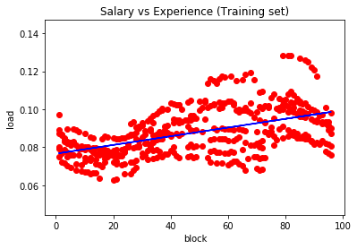

```python
# following the tutorial from : https://medium.com/@contactsunny/linear-regression-in-python-using-scikit-learn-f0f7b125a204

import pandas as pd
import numpy as np
import matplotlib.pyplot as plt
from sklearn.model_selection import train_test_split
from sklearn.linear_model import LinearRegression

df = pd.read_excel('data/data.xls')
```

```python
df[0: 2]
```

<table border="1" class="dataframe">
  <thead>
    <tr style="text-align: right;">
      <th></th>
      <th>date</th>
      <th>block</th>
      <th>frequency_hz</th>
      <th>ui_rate_rs</th>
      <th>cap_rate_rs</th>
      <th>rate101_rs</th>
      <th>drawal_mus</th>
      <th>schedule_mus</th>
      <th>uo_drawal_mus</th>
      <th>ui_charges</th>
      <th>goacapui403_rs_lakh</th>
      <th>addl_ui_rs_lakh</th>
      <th>uo_drawl_in_mw</th>
    </tr>
  </thead>
  <tbody>
    <tr>
      <th>0</th>
      <td>10-Sep-18</td>
      <td>1</td>
      <td>49.90</td>
      <td>3.8640</td>
      <td>0</td>
      <td>0</td>
      <td>0.079993</td>
      <td>0.078113</td>
      <td>-0.001880</td>
      <td>0.07262</td>
      <td>0.0</td>
      <td>0.0</td>
      <td>-7.518072</td>
    </tr>
    <tr>
      <th>1</th>
      <td>10-Sep-18</td>
      <td>2</td>
      <td>49.94</td>
      <td>3.0304</td>
      <td>0</td>
      <td>0</td>
      <td>0.079763</td>
      <td>0.078375</td>
      <td>-0.001388</td>
      <td>0.04206</td>
      <td>0.0</td>
      <td>0.0</td>
      <td>-5.551172</td>
    </tr>
  </tbody>
</table>


```python
df.loc[:5,['date', 'drawal_mus']]
```

<table border="1" class="dataframe">
  <thead>
    <tr style="text-align: right;">
      <th></th>
      <th>date</th>
      <th>drawal_mus</th>
    </tr>
  </thead>
  <tbody>
    <tr>
      <th>0</th>
      <td>10-Sep-18</td>
      <td>0.079993</td>
    </tr>
    <tr>
      <th>1</th>
      <td>10-Sep-18</td>
      <td>0.079763</td>
    </tr>
    <tr>
      <th>2</th>
      <td>10-Sep-18</td>
      <td>0.078928</td>
    </tr>
    <tr>
      <th>3</th>
      <td>10-Sep-18</td>
      <td>0.077580</td>
    </tr>
    <tr>
      <th>4</th>
      <td>10-Sep-18</td>
      <td>0.075975</td>
    </tr>
    <tr>
      <th>5</th>
      <td>10-Sep-18</td>
      <td>0.075724</td>
    </tr>
  </tbody>
</table>


```python
x = df.iloc[:, 1].values
y = df.iloc[:, 6].values
```


```python
x1 = df.loc[:, ['block']].values
y1 = df.loc[:, ['drawal_mus']].values
```


```python
x1[:5]
```


    array([[1],
           [2],
           [3],
           [4],
           [5]])


```python
xTrain, xTest, yTrain, yTest = train_test_split(x1, y1, test_size = 1/3, random_state = 0)
```


```python
linearRegressor = LinearRegression()
```


```python
xTrain[:5]
```


    array([[91],
           [47],
           [76],
           [70],
           [71]])


```python
linearRegressor.fit(xTrain, yTrain)
```


    LinearRegression(copy_X=True, fit_intercept=True, n_jobs=None,
             normalize=False)


```python
yPrediction = linearRegressor.predict(xTest)
```


```python
plt.scatter(xTrain, yTrain, color = 'red')
plt.plot(xTrain, linearRegressor.predict(xTrain), color = 'blue')
plt.title('Salary vs Experience (Training set)')
plt.xlabel('block')
plt.ylabel('load')
plt.show()
```




